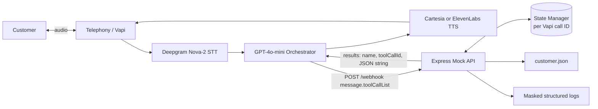
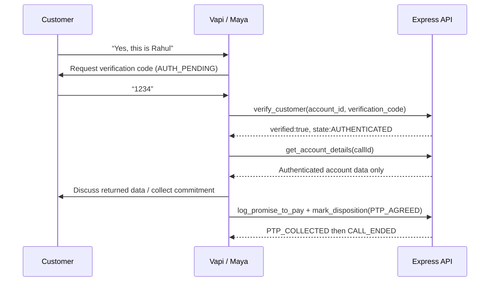

# System Architecture

The Express layer, not prompt text, owns the authentication gate. It will not return debt data or allow payment actions until `verify_customer` succeeds for the same Vapi call ID. Any final disposition, including DNC, transitions the call to `CALL_ENDED` and blocks later tools.
